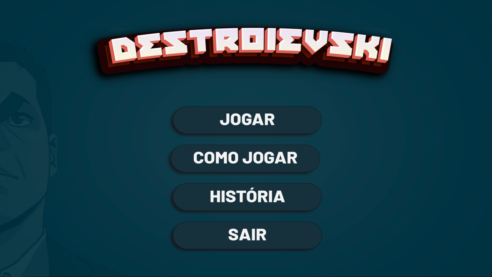
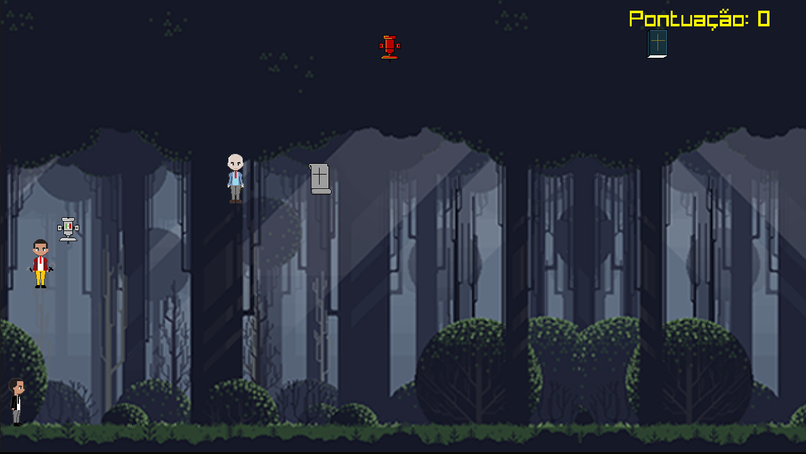

# Destroievski

Projeto desenvolvido em 2021 para a disciplina de Introdução a Programação- CIn, UFPE.

<h3> Destroievski </h3>

Destroievski é um jogo realizado em C com uso da biblioteca Raylib, ele brinca com uma satira politica, relacionada ao Cabo Daciolo.

<h3>Time:</h3>

+ Beatriz Feitoza

+ Breno Cavalcanti

+ João Victor Belo 

+ Matheus Batista

<h3>Tecnologias utilizadas no desenvolvimento:</h3>

+ C
+ Raylib

<h3>Links úteis:</h3>

+ https://www.raylib.com/ - Documentação da biblioteca raylib.

+ https://fruitsaladfrog.itch.io/pixel-character-base - Pack de pixel art usado como base para fazer os personagens

+ https://edermunizz.itch.io/free-pixel-art-forest - Modelo do mapa utilizado para o desenvolvimento do jogo

## Como testar(disponível do classroom)
-1) Baixar e extrair o raylib em algum lugar conhecido no seu pc
https://github.com/raysan5/raylib

-2) Vá para a pasta src dentro do raylib e rode o comando:
    windows:

           mingw32-make PLATFORM=PLATFORM_DESKTOP
    linux:

            make PLATFORM=PLATFORM_DESKTOP
            sudo make install

-3) Baixe o Makefile com o main.c
https://gist.github.com/gbrls/6ba9f42315e8c40b0a1115fe65fd50e6/archive/c7f7348328fa4eaf539e5ce80808d58f9dcba177.zip

Extraia e edite a linha 30 do makefile com o caminho para onde você colocou o raylib

-4) Pronto, se tudo deu certo você pode rodar este comando na pasta onde está o main.c e o Makefile
make PLATFORM=PLATFORM_DESKTOP

-5) Se estiver no windows execute o .exe, se estiver em linux execute `./game`

## Imagens do jogo

